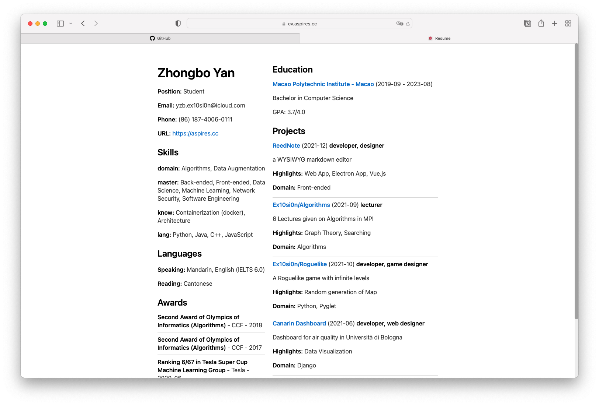

# Resume maker
### QuickStart:
```bash
# Run script to fill in your resume
python resume.py

# Modify json if needed
vim *_resume.json

# Installation surge globally 
npm install -g surge

# Resolve to your sub-domain
touch CNAME

# Deploy to live web server
surge
```
### Preview
URL: [cv.aspires.cc](https://cv.aspires.cc)
